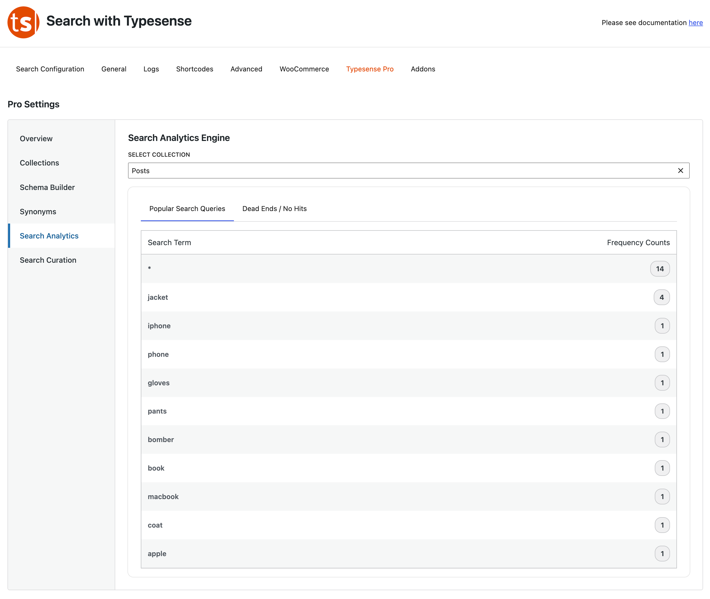
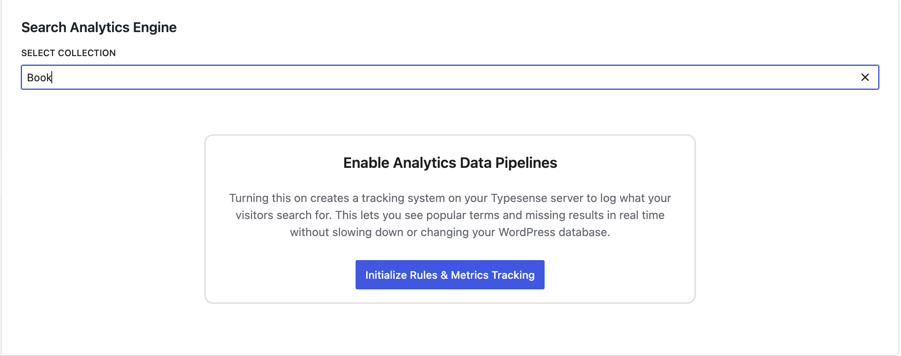

# Reviewing Your Search Reports

The **Search Analytics Engine** gives you a clear window into what your audience wants, pointing out what is popular and what is currently missing on your site.

### Requirements
* Analytics Needs to be enabled for this feature to work
* If you are running a new instance of Typesense Cloud analytics will be enabled by default
* If you are running a self-hosted instance, please have a look at the [documentation](https://typesense.org/docs/30.2/api/analytics-query-suggestions.html#enabling-the-feature).

### The Two Critical Tabs
*   **Popular Search Queries:** This displays a leaderboard of the exact words your users search for most frequently, alongside an exact tally of how many times they looked it up. Use this to discover trends or feature popular items on your homepage.
*   **Dead Ends / No Hits:** This is your hidden goldmine. It highlights the exact words users are looking for that returned **0 results**. If you see dozens of people searching for *"gloves"* and getting nothing back, it might be time to stock a new product or write a new article!

### Enable Analytics
* Select the Collection to enable search analytics.
* You will be prompted to enable analytics 
* Click Initialize Rules & Metrics Tracking
* Once Completed you're done – you will start seeing the most Popular Search Queries / Dead Endds/ No Results