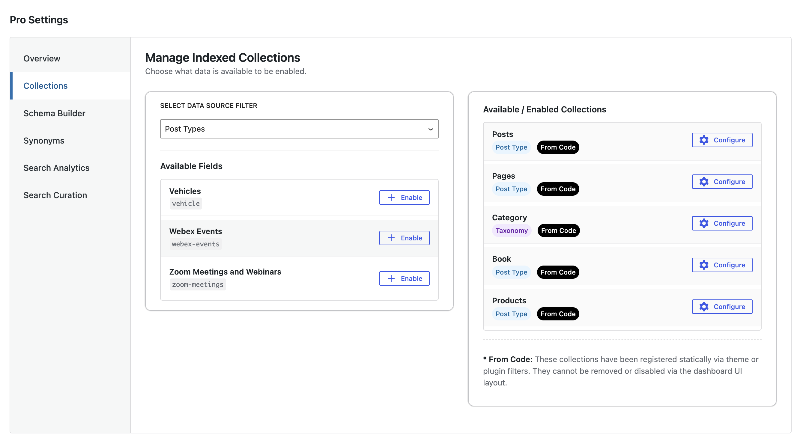

# Managing Your Searchable Content

The **Collections** manager lets you control exactly what parts of your website are available when a user types into the search box.

### How to Make Content Searchable
1. Look at the **Available Fields** panel on the left.
2. Choose from Available Post Types / Taxonomies
3. Find the content type you want to include.
4. Click the **+ Enable** button. It will instantly move over to your active list on the right.

### Managing Active Content
*   **Static Items (Labeled "From Code"):** These have been locked in by your developer or theme. They ensure core content like your primary posts or products are always searchable and cannot accidentally be turned off.
*   **Custom Content:** Any content types you manually enabled can be stopped at any time by clicking the red **X Disable** button. **Note**: This does not drop your collection – only disables it on Wordpress