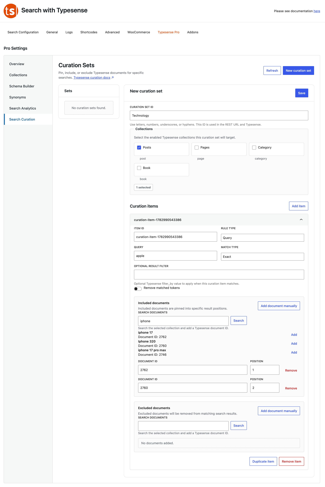

# Hand-Picking Results (Curation)

Curation gives you ultimate editorial control. It lets you override the regular search algorithm and manually control exactly what shows up at the top of the list when a visitor looks up a specific phrase.

### How to Feature Specific Content
1. Click **New Curation Set** and give it a descriptive title.
2. Under **Collections**, check the boxes for the content types you want this rule to apply to (e.g., *Posts* and *Pages*).
3. Under **Curation Items**, type the keyword trigger into the **Query** box (e.g., if someone types *"phone"*).
4. Set **Match Type** to **Exact** if it should only trigger for that precise keyword.

### Pinning vs. Hiding Documents
*   **Included Documents:** Click *Add document manually* and enter your specific post or product ID to force it right to the absolute top of the results page. Perfect for promoting a sale item or a foundational guide!
*   **Excluded Documents:** Want to hide an outdated page or a specific page from appearing *only* when someone looks up that exact phrase? Paste its ID here to drop it completely out of view.