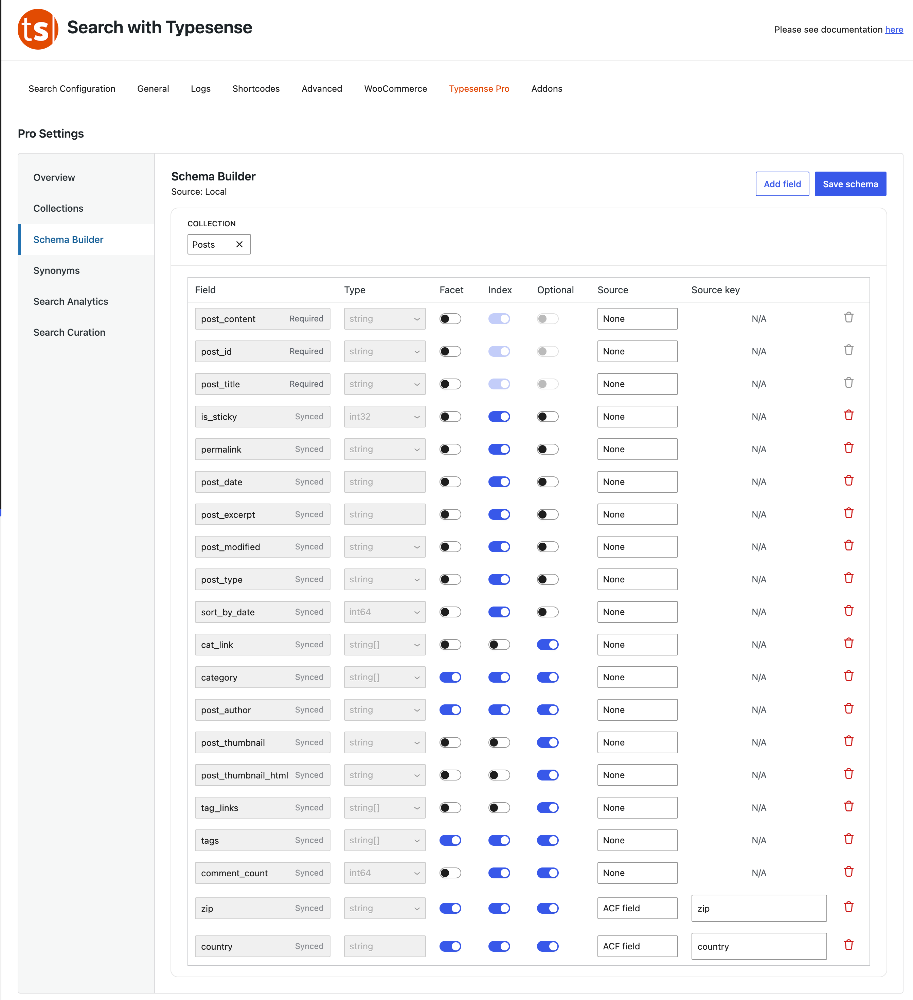

# Customizing Your Search Fields

The **Schema Builder** tells the search engine exactly what information to prioritize and look through when a visitor types a query.

### Understanding Your Search Fields Dashboard
Each row represents a specific piece of information attached to your content (like the title, date, or a category label).

*   **Required Fields:** These are crucial pieces of data (like the text content or title) that the system must have to show a result.
*   **Synced Fields:** These are standard details automatically pulled directly from WordPress to keep setups effortless.
*   **The Facet Switch:** Turn this on if you want users to be able to *filter* their search results by this field (for example, filtering products by a specific category sidebar).
*   **The Index Switch:** If this is turned off, the search engine will ignore the words inside this field entirely when looking up results.
*   **Adding Custom Details:** Click **Add Field** at the top to create a custom data row, assign where it pulls data from via the **Source** dropdown, and click **Save Schema** when finished.
* Source can be:
    - Post Fields : Post Title, Post Content, Post Excerpt, Post Date, Menu Order, Author ID
    - Post Meta : This is useful to get fields with meta-data custom or otherwise that you have added.
    - Taxonomy : Select any Taxonomy associated with a Post Type - use String[] for facets
    - ACF Field: Requires ACF to be enabled – allows you to get data from ACF Fields
    - Term Field: (For Taxonomies) : Name, Slug, Description, Count
    - Term Field: Similar to Post Meta you can specify term meta fields

**"Important Step After Saving"**
Whenever you alter settings or add fields here, your data needs to be compiled fresh. Be sure to head over to the main **Search Configuration** tab to run a re-index so the changes show up live on your website!

## Schema ##
While the interface is designed to make it easier for users. A basic understanding of how typesense schema works will be beneficial – please see the [official docs](https://typesense.org/docs/30.2/api/collections.html#field-types) 